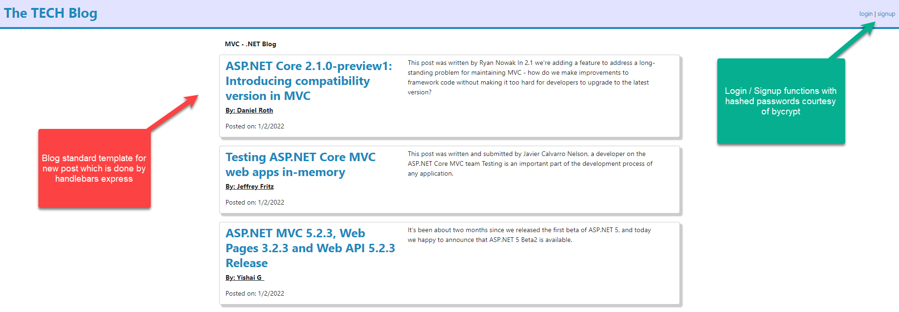
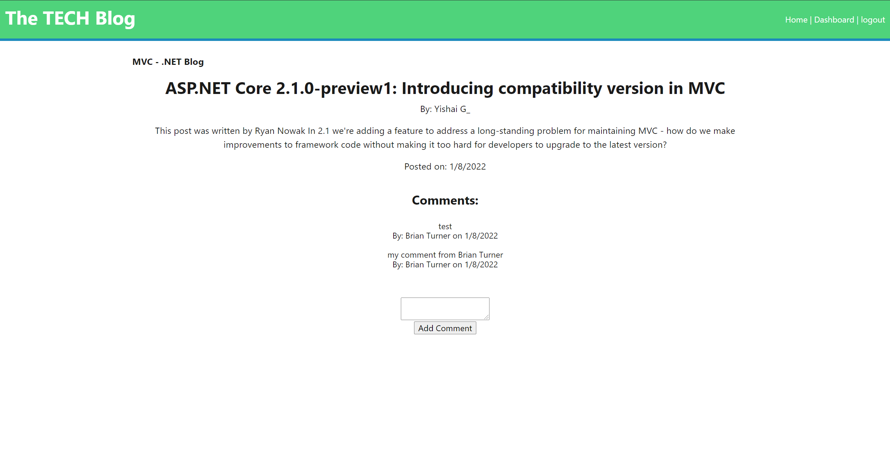
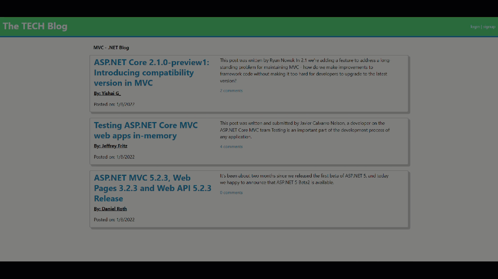

# MVC Tech Blog 

## Brief Description 📖
   A CMS-style MVC Tech Blog capable of publishing articles, posts, and opinions on Model-View-Controller technology

## Table of Contents 💡
   * [Brief Description](#description)
   * [About MVC Tech Blog](#about)
   * [Installation](#install)
   * [Usage](#usage)
   * [Testing](#test)
   * [Screenshots](#screenshots)
   * [Demo Video](#demo)
   * [Github Pages Link](#pages) 
   * [Github Repo Link](#repo)
   * [Contact Details](#contact)
   * [License](#license)
   * [Contributions to Repo](#contributions)
   * [Additional Information](#info)

## About MVC Tech Blog 
   This project is a blog site based upon technologies such as express-handlebars, MYSQL2, Sequelize, Dotenv package, Express-session, and bcrypt package for hashing passwords to protect our tech blog users
   
## Installation 🏗️
   npm i
 
## Usage 📝
   npm run seed initially and then npm start to start server   
      
## Testing 
   npm test

## Screenshots 📷
   
    
   
    

## Demo .GIF Video 📷
   
    

## Demo YouTube.com Video 
   <a href="https://youtu.be/R71w3BH9yR0" target="_blank">----==== YouTube.com Video Link (with audio) ====----</a>
    
        
## Github Pages Link 
   <a href="https://bkturner1220.github.io/MVC-Tech_Blog" target="_blank">https://bkturner1220.github.io/MVC-Tech_Blog</a>
   
## Github Repo Link 
   <a href="https://github.com/bkturner1220/MVC-Tech_Blog" target="_blank">https://github.com/bkturner1220/MVC-Tech_Blog</a>

   ## Heroku Deployed Link 
   <a href="https://frozen-tundra-76931.herokuapp.com/" target="_blank">https://frozen-tundra-76931.herokuapp.com/</a>
     
## Contact Information 
   Github Username: [bkturner1220](https://github.com/bkturner1220/) 
   Github: <a href="https://github.com/bkturner1220/">https://github.com/bkturner1220/</a> 
   Email: <a href="mailto:bturner@texascdlprep.com">bturner@texascdlprep.com</a>
   
## License Information 
 
   The application is covered under MIT license.
   
## Contributions towards MVC Tech Blog 🏆
   SMU Coding Bootcamp MVC-14 and LOTS of documentation :)
         
## Additional Information 
   If you encounter any problems, please feel free to reach out to me by sending me a [Email] to <a href="mailto:bturner@texascdlprep.com">bturner@texascdlprep.com</a>.